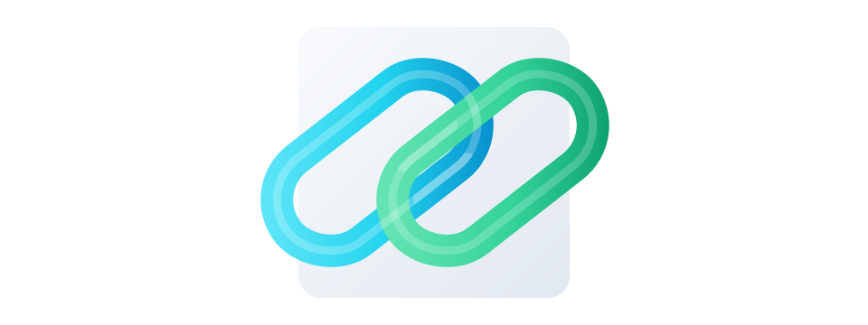

# links

<p align="center">
  
</p>

`links-issue-tracker` (`lit`) is a tool that allows your agents to track work. Inspired by `beads` but designed to be reliable with a minimal surface area.

## Inspiration and Credit

This project is directly inspired by [beads](https://github.com/steveyegge/beads).

The goal of `links` is to apply the same core idea in this codebase: treat issue tracking as part of the repository workflow so agents and humans can coordinate through a fast local CLI and syncable state.

Most of the credit for the ideas behind this workflow should go to the creator of beads, Steve Yegge.

## Quickstart

Requirements:
- Git repository/worktree
- Dolt CLI `>= 1.81.10`

Install:

```sh
./scripts/install.sh
```

Install from outside a checkout:

```sh
go install github.com/bmf/links-issue-tracker/cmd/lit@latest
```

# TODO: improve readme.  DO NOT copy command output from cli commands here!